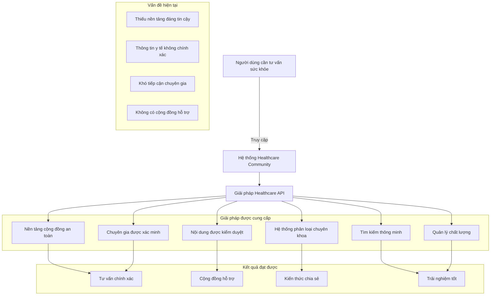
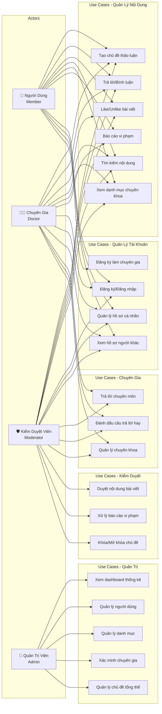

# 🏥 API Web Health Care - Hướng Dẫn Cài Đặt và Chạy Project

## 📖 Giới Thiệu

**API Web Health Care** là một hệ thống quản lý cộng đồng sức khỏe toàn diện, cung cấp nền tảng tương tác giữa người dùng, chuyên gia y tế và quản trị viên. Hệ thống được thiết kế để giải quyết nhu cầu tư vấn sức khỏe trực tuyến và xây dựng cộng đồng chia sẻ kiến thức y tế đáng tin cậy.

### 🎯 Mục Tiêu Hệ Thống

- **Kết nối cộng đồng:** Tạo ra không gian an toàn để người dùng đặt câu hỏi và thảo luận về sức khỏe
- **Tư vấn chuyên môn:** Kết nối người dùng với các chuyên gia y tế đã được xác minh
- **Quản lý nội dung:** Đảm bảo chất lượng thông tin thông qua hệ thống kiểm duyệt
- **Phân loại chuyên môn:** Tổ chức nội dung theo các chuyên khoa y tế cụ thể

### 🌟 Tính Năng Chính

#### 👥 **Dành cho Người Dùng:**

- Đăng ký/Đăng nhập tài khoản
- Tạo và quản lý chủ đề thảo luận
- Tham gia thảo luận, bình luận, like/unlike
- Tìm kiếm chủ đề theo từ khóa và danh mục
- Xem hồ sơ và theo dõi chuyên gia
- Báo cáo nội dung không phù hợp
- Quản lý hồ sơ cá nhân

#### 👨‍⚕️ **Dành cho Chuyên Gia Y Tế:**

- Đăng ký làm chuyên gia với thông tin chuyên môn
- Trả lời câu hỏi trong lĩnh vực chuyên môn
- Đánh dấu câu trả lời chất lượng
- Quản lý danh sách chuyên khoa

#### 🛡️ **Dành cho Quản Trị Viên:**

- Dashboard tổng quan với thống kê hệ thống
- Quản lý người dùng (kích hoạt/khóa tài khoản)
- Quản lý danh mục và chủ đề
- Xét duyệt và xác minh chuyên gia
- Xử lý báo cáo vi phạm
- Quản lý nội dung (ghim, khóa, xóa)

## 🏗️ Sơ Đồ Mô Tả Bài Toán



## 👥 Lược Đồ Use Case



## 🏛️ Kiến Trúc Hệ Thống

```mermaid
graph TB
    subgraph "Frontend Layer"
        direction TB
        UA[👥 User Interface<br/>React + TypeScript]
        AA[🛡️ Admin Panel<br/>React + TypeScript]

        subgraph "User Features"
            UF1[Trang chủ & Tìm kiếm]
            UF2[Quản lý chủ đề]
            UF3[Hồ sơ người dùng]
            UF4[Danh sách chuyên gia]
        end

        subgraph "Admin Features"
            AF1[Dashboard & Thống kê]
            AF2[Quản lý người dùng]
            AF3[Quản lý nội dung]
            AF4[Xét duyệt chuyên gia]
        end

        UA --> UF1
        UA --> UF2
        UA --> UF3
        UA --> UF4

        AA --> AF1
        AA --> AF2
        AA --> AF3
        AA --> AF4
    end

    subgraph "API Gateway Layer"
        direction TB
        API[🌐 ASP.NET Core Web API<br/>Port 5000]

        subgraph "API Endpoints"
            UE[📱 User Endpoints<br/>/api/user/*]
            AE[🔧 Admin Endpoints<br/>/api/admin/*]
        end

        API --> UE
        API --> AE
    end

    subgraph "Business Logic Layer"
        direction TB

        subgraph "User Services"
            US1[UserAuthService<br/>Đăng nhập/Đăng ký]
            US2[UserTopicService<br/>Quản lý chủ đề]
            US3[UserProfileService<br/>Hồ sơ người dùng]
            US4[UserExpertService<br/>Danh sách chuyên gia]
            US5[UserHomeService<br/>Trang chủ & Tìm kiếm]
        end

        subgraph "Admin Services"
            AS1[AdminAuthService<br/>Xác thực admin]
            AS2[AdminUserService<br/>Quản lý user]
            AS3[AdminTopicService<br/>Quản lý nội dung]
            AS4[AdminExpertService<br/>Xét duyệt chuyên gia]
            AS5[AdminDashboardService<br/>Thống kê hệ thống]
        end

        subgraph "Common Services"
            CS1[JwtService<br/>JWT Token Management]
            CS2[HtmlSanitizerService<br/>Lọc nội dung HTML]
        end
    end

    subgraph "Data Access Layer"
        direction TB
        EF[📊 Entity Framework Core<br/>ORM & Database Context]

        subgraph "Data Models"
            DM1[UserAccount<br/>Người dùng]
            DM2[Topic & Post<br/>Nội dung]
            DM3[Category<br/>Danh mục]
            DM4[Specialty<br/>Chuyên khoa]
            DM5[AdminAccount<br/>Quản trị viên]
        end

        EF --> DM1
        EF --> DM2
        EF --> DM3
        EF --> DM4
        EF --> DM5
    end

    subgraph "Database Layer"
        DB[(🗄️ SQLite Database<br/>healthcare.db)]
    end

    %% Connections
    UA -.->|HTTP Requests| UE
    AA -.->|HTTP Requests| AE

    UE --> US1
    UE --> US2
    UE --> US3
    UE --> US4
    UE --> US5

    AE --> AS1
    AE --> AS2
    AE --> AS3
    AE --> AS4
    AE --> AS5

    US1 --> CS1
    US2 --> CS2
    AS1 --> CS1
    AS3 --> CS2

    US1 --> EF
    US2 --> EF
    US3 --> EF
    US4 --> EF
    US5 --> EF

    AS1 --> EF
    AS2 --> EF
    AS3 --> EF
    AS4 --> EF
    AS5 --> EF

    EF --> DB

    classDef frontend fill:#e1f5fe
    classDef api fill:#f3e5f5
    classDef service fill:#e8f5e8
    classDef data fill:#fff3e0
    classDef database fill:#fce4ec

    class UA,AA,UF1,UF2,UF3,UF4,AF1,AF2,AF3,AF4 frontend
    class API,UE,AE api
    class US1,US2,US3,US4,US5,AS1,AS2,AS3,AS4,AS5,CS1,CS2 service
    class EF,DM1,DM2,DM3,DM4,DM5 data
    class DB database
```



## 🔧 Chi Tiết Kỹ Thuật

### 🛠️ Backend - ASP.NET Core API

#### **Cấu Trúc Project:**

```
📁 ApiApplication/
├── 📁 Controllers/
│   ├── 📁 Admin/          # API endpoints cho Admin
│   └── 📁 User/           # API endpoints cho User
├── 📁 Services/
│   ├── 📁 Admin/          # Business logic cho Admin
│   ├── 📁 User/           # Business logic cho User
│   └── 📁 Common/         # Services dùng chung
├── 📁 Models/
│   ├── 📁 Entities/       # Database models
│   └── 📁 DTOs/           # Data Transfer Objects
├── 📁 Data/               # Database Context
└── 📁 Migrations/         # EF Core Migrations
```

#### **Database Schema:**

| **Bảng**             | **Mục đích**           | **Quan hệ chính**                           |
| -------------------- | ---------------------- | ------------------------------------------- |
| `AdminAccounts`      | Quản trị viên          | -                                           |
| `UserAccounts`       | Người dùng, chuyên gia | `1:N` với Topics, Posts                     |
| `Categories`         | Danh mục chuyên khoa   | `1:N` với Topics                            |
| `Topics`             | Chủ đề thảo luận       | `1:N` với Posts, belongs to Category & User |
| `Posts`              | Bài viết/Phản hồi      | Belongs to Topic & User, `1:N` với Replies  |
| `Specialties`        | Chuyên khoa y tế       | `N:N` với UserAccounts                      |
| `Likes`              | Tương tác like/unlike  | Belongs to User, Topic/Post                 |
| `Reports`            | Báo cáo vi phạm        | Belongs to User, Topic/Post                 |
| `TopicViews`         | Lượt xem chủ đề        | Tracking views                              |
| `Tags` & `TopicTags` | Gắn thẻ chủ đề         | `N:N` mapping                               |

#### **API Endpoints:**

**User APIs (`/api/user/`):**

- `auth/*` - Đăng ký, đăng nhập, quản lý token
- `home/*` - Trang chủ, thống kê, tìm kiếm
- `topics/*` - CRUD chủ đề, bài viết, like/unlike
- `categories/*` - Danh sách danh mục, chủ đề theo danh mục
- `experts/*` - Danh sách chuyên gia, tìm kiếm chuyên gia
- `profile/*` - Hồ sơ cá nhân, chủ đề của user

**Admin APIs (`/api/admin/`):**

- `auth/*` - Đăng nhập admin
- `dashboard/*` - Thống kê tổng quan hệ thống
- `users/*` - Quản lý người dùng (CRUD, activate/deactivate)
- `categories/*` - Quản lý danh mục (CRUD, reorder)
- `topics/*` - Quản lý chủ đề (pin/unpin, lock/unlock, delete)
- `experts/*` - Xét duyệt chuyên gia (verify/reject, manage specialties)
- `search/*` - Tìm kiếm toàn bộ hệ thống

### 🎨 Frontend - React Applications

#### **User Interface (`View/user/`):**

**Cấu trúc Pages:**

- `HomePage` - Trang chủ với chủ đề nổi bật, thống kê
- `LoginPage` & `RegisterPage` - Xác thực người dùng
- `TopicsPage` - Danh sách tất cả chủ đề với filter/sort
- `TopicDetailPage` - Chi tiết chủ đề + danh sách posts/replies
- `CreateTopicPage` - Tạo chủ đề mới với editor
- `CategoriesPage` - Danh sách tất cả danh mục chuyên khoa
- `CategoryPage` - Chủ đề theo danh mục cụ thể
- `ExpertsPage` - Danh sách chuyên gia với filter chuyên khoa
- `SearchPage` - Tìm kiếm nâng cao với filters
- `ProfilePage` - Hồ sơ cá nhân (edit profile, manage topics)
- `UserProfilePage` - Xem hồ sơ công khai của user khác
- `EmergencyPage` - Trang thông tin cấp cứu y tế

#### **Admin Panel (`View/admin/`):**

**Cấu trúc Pages:**

- `DashboardPage` - Biểu đồ thống kê, tổng quan hệ thống
- `UsersPage` - Bảng quản lý người dùng với actions
- `CategoriesPage` - Quản lý danh mục (CRUD, drag-drop reorder)
- `TopicsPage` - Quản lý chủ đề (pin, lock, delete, view details)
- `ExpertsPage` - Xét duyệt hồ sơ chuyên gia (verify/reject)
- `ReportsPage` - Xử lý báo cáo vi phạm (review, resolve)
- `ProfilePage` - Thông tin admin, đổi mật khẩu

### 🔐 Bảo Mật & Xác Thực

#### **JWT Authentication:**

- **User JWT:** Chứa UserId, Username, Role (Member/Doctor/Moderator)
- **Admin JWT:** Chứa AdminId, Username, Role (Admin/SuperAdmin)
- **Token Expiry:** 7 ngày cho security balance
- **Refresh Logic:** Auto-refresh khi còn thời hạn

#### **Authorization Levels:**

1. **Anonymous:** Xem nội dung công khai, tìm kiếm
2. **Member:** Tạo chủ đề, bình luận, like, quản lý profile
3. **Doctor:** + Trả lời chuyên môn, đánh dấu best answer
4. **Moderator:** + Khóa chủ đề, xóa nội dung vi phạm
5. **Admin:** Full access to admin panel
6. **SuperAdmin:** + Quản lý admin accounts

#### **Data Validation & Sanitization:**

- **Input Validation:** FluentValidation cho tất cả DTOs
- **HTML Sanitization:** HtmlSanitizerService để lọc XSS
- **SQL Injection:** Entity Framework parameterized queries
- **CORS Policy:** Configured cho frontend domains
- **Rate Limiting:** Planned cho API abuse prevention

## 🔧 Yêu Cầu Hệ Thống

### Windows 10/11

- RAM: Tối thiểu 4GB, khuyến nghị 8GB+
- Ổ cứng: Ít nhất 5GB dung lượng trống
- Kết nối Internet để tải dependencies

## 📥 Bước 1: Cài Đặt Phần Mềm Cần Thiết

### 1.1. Cài Đặt .NET 8.0 SDK

1. Truy cập: https://dotnet.microsoft.com/download/dotnet/8.0
2. Tải về "SDK 8.0.x" (chọn phiên bản mới nhất)
3. Chạy file installer và làm theo hướng dẫn
4. Kiểm tra cài đặt:
   ```bash
   dotnet --version
   ```
   ➡️ Kết quả phải hiển thị: `8.0.x`

### 1.2. Cài Đặt Node.js (phiên bản 18+)

1. Truy cập: https://nodejs.org/
2. Tải về "LTS" (phiên bản ổn định)
3. Chạy file installer và làm theo hướng dẫn
4. Kiểm tra cài đặt:
   ```bash
   node --version
   npm --version
   ```
   ➡️ Kết quả Node.js: `v18.x.x` hoặc cao hơn
   ➡️ Kết quả npm: `9.x.x` hoặc cao hơn

### 1.3. Cài Đặt Git (Tùy chọn)

1. Truy cập: https://git-scm.com/downloads
2. Tải về và cài đặt
3. Kiểm tra: `git --version`

### 1.4. Cài Đặt Visual Studio Code (Khuyến nghị)

1. Truy cập: https://code.visualstudio.com/
2. Tải về và cài đặt
3. Cài đặt các extension hữu ích:
   - C# DevKit
   - ES7+ React/Redux/React-Native snippets
   - Tailwind CSS IntelliSense
   - Auto Rename Tag
   - Bracket Pair Colorizer
   - GitLens

## 📂 Bước 2: Tải Source Code

### Cách 1: Sử dụng Git (Khuyến nghị)

```bash
# Tạo thư mục dự án
mkdir D:\Projects
cd D:\Projects

# Clone repository (thay YOUR_REPO_URL bằng URL thực tế)
git clone YOUR_REPO_URL api-web-health-care
cd api-web-health-care
```

### Cách 2: Tải file ZIP

1. Tải file ZIP từ repository
2. Giải nén vào `D:\Projects\api-web-health-care`
3. Mở Command Prompt/PowerShell tại thư mục này

## 🚀 Bước 3: Thiết Lập Backend API

### 3.1. Cài Đặt Entity Framework Tools

```bash
# Cài đặt EF tools globally
dotnet tool install --global dotnet-ef

# Kiểm tra cài đặt
dotnet ef --version
```

### 3.2. Khôi Phục Dependencies

```bash
# Đảm bảo đang ở thư mục root của project
cd D:\Projects\api-web-health-care

# Khôi phục packages
dotnet restore
```

### 3.3. Tạo Database

```bash
# Tạo database và áp dụng migrations
dotnet ef database update

# Kiểm tra - file database.db sẽ được tạo
dir | findstr database.db
```

### 3.4. Chạy Backend API

```bash
# Chạy ứng dụng
dotnet run

# Hoặc chạy trong chế độ watch (tự restart khi có thay đổi)
dotnet watch run
```

**✅ Kết quả mong đợi:**

```
Using launch settings from D:\Projects\api-web-health-care\Properties\launchSettings.json...
info: Microsoft.Hosting.Lifetime[14]
      Now listening on: http://localhost:5002
info: Microsoft.Hosting.Lifetime[14]
      Now listening on: https://localhost:7002
```

**🌐 Kiểm tra API:**

- Swagger UI: http://localhost:5002/swagger
- API Base: http://localhost:5002
- API HTTPS: https://localhost:7002

## 🎨 Bước 4: Thiết Lập Frontend Admin Panel

### 4.1. Mở Terminal Mới

**Quan trọng**: Giữ nguyên terminal đang chạy backend, mở terminal mới

### 4.2. Cài Đặt Dependencies

```bash
# Di chuyển vào thư mục admin
cd D:\Projects\api-web-health-care\View\admin

# Cài đặt dependencies
npm install

# Chờ quá trình cài đặt hoàn thành (có thể mất 2-5 phút)
```

### 4.3. Chạy Admin Panel

```bash
# Chạy development server
npm run dev
```

**✅ Kết quả mong đợi:**

```
  VITE v7.1.2  ready in 1234 ms

  ➜  Local:   http://localhost:5173/
  ➜  Network: use --host to expose
  ➜  press h + enter to show help
```

**🌐 Truy cập Admin Panel:**

- URL: http://localhost:5173
- Tài khoản admin mặc định:
  - Username: `admin`
  - Password: `admin123`

## 👥 Bước 5: Thiết Lập Frontend User Interface

### 5.1. Mở Terminal Thứ 3

**Quan trọng**: Giữ nguyên 2 terminal đang chạy, mở terminal thứ 3

### 5.2. Cài Đặt Dependencies

```bash
# Di chuyển vào thư mục user
cd D:\Projects\api-web-health-care\View\user

# Cài đặt dependencies
npm install
```

### 5.3. Chạy User Interface

```bash
# Chạy development server
npm run dev
```

**✅ Kết quả mong đợi:**

```
  VITE v7.1.2  ready in 1234 ms

  ➜  Local:   http://localhost:5174/
  ➜  Network: use --host to expose
```

**🌐 Truy cập User Interface:**

- URL: http://localhost:5174
- Tài khoản user test:
  - Username: `nguoidung1`
  - Password: `matkhau123`

## 🎯 Bước 6: Kiểm Tra Hoạt Động

### 6.1. Kiểm Tra Backend API

1. Mở trình duyệt: http://localhost:5002/swagger
2. Xem danh sách API endpoints
3. Test API `/api/categories` (không cần authentication)

### 6.2. Kiểm Tra Admin Panel

1. Mở trình duyệt: http://localhost:5173
2. Đăng nhập với admin/admin123
3. Kiểm tra dashboard, quản lý users, categories

### 6.3. Kiểm Tra User Interface

1. Mở trình duyệt: http://localhost:5174
2. Đăng nhập với nguoidung1/matkhau123
3. Kiểm tra trang chủ, danh mục, topics

## 📊 Tóm Tắt URLs và Ports

| Thành Phần          | URL                           | Port | Ghi Chú      |
| ------------------- | ----------------------------- | ---- | ------------ |
| Backend API         | http://localhost:5002         | 5002 | API chính    |
| Backend API (HTTPS) | https://localhost:7002        | 7002 | API bảo mật  |
| Swagger UI          | http://localhost:5002/swagger | 5002 | Tài liệu API |
| Admin Panel         | http://localhost:5173         | 5173 | Quản trị     |
| User Interface      | http://localhost:5174         | 5174 | Người dùng   |

## 🔧 Cấu Hình Môi Trường

### Database

- **Loại**: SQLite
- **File**: `database.db` (tự động tạo)
- **Location**: Thư mục root của project

### Tài Khoản Mặc Định

#### Admin Account

- Username: `admin`
- Password: `admin123`
- Email: `admin@example.com`

#### User Test Accounts

- Username: `nguoidung1` đến `nguoidung20`
- Password: `matkhau123` (tất cả accounts)
- Roles: Member, Doctor, Moderator

## 🛠️ Scripts Hữu Ích

### Backend

```bash
# Chạy với watch mode
dotnet watch run

# Build project
dotnet build

# Clean build
dotnet clean

# Tạo migration mới
dotnet ef migrations add YourMigrationName

# Reset database
dotnet ef database drop
dotnet ef database update
```

### Frontend

```bash
# Admin Panel
cd View/admin
npm run dev          # Development server
npm run build        # Build production
npm run lint         # Check linting
npm run lint:fix     # Fix linting issues

# User Interface
cd View/user
npm run dev          # Development server
npm run build        # Build production
npm run lint         # Check linting
npm run lint:fix     # Fix linting issues
```

## 🐛 Xử Lý Sự Cố Thường Gặp

### Lỗi: "dotnet command not found"

**Giải pháp**: Cài đặt lại .NET SDK và restart terminal

### Lỗi: "npm command not found"

**Giải pháp**: Cài đặt lại Node.js và restart terminal

### Lỗi: "Port already in use"

**Giải pháp**:

```bash
# Tìm process đang sử dụng port
netstat -ano | findstr :5002

# Kill process (thay PID bằng số thực tế)
taskkill /PID <PID> /F
```

### Lỗi: "no such table: Reports"

**Giải pháp**:

```bash
# Xóa database và tạo lại
del database.db
dotnet ef database update
```

### Lỗi Frontend không kết nối được Backend

**Giải pháp**:

1. Kiểm tra backend đang chạy tại port 5002
2. Kiểm tra CORS settings
3. Restart cả backend và frontend

### Lỗi: "ECONNREFUSED" khi install npm

**Giải pháp**:

```bash
# Clear npm cache
npm cache clean --force

# Cài đặt lại
npm install
```

## 📝 Ghi Chú Quan Trọng

1. **Thứ tự khởi động**: Luôn chạy Backend trước, sau đó Frontend
2. **Development Mode**: Tất cả đều chạy ở chế độ development với hot-reload
3. **Database**: SQLite database sẽ tự động tạo data mẫu khi chạy lần đầu
4. **Security**: JWT tokens được sử dụng cho authentication
5. **CORS**: Đã được cấu hình để cho phép frontend kết nối

## 🚀 Production Deployment

Để deploy production, tham khảo:

- Backend: Publish với `dotnet publish`
- Frontend: Build với `npm run build`
- Database: Có thể chuyển từ SQLite sang SQL Server/PostgreSQL

## 📞 Hỗ Trợ

Nếu gặp vấn đề, hãy kiểm tra:

1. Phiên bản .NET 8.0+
2. Phiên bản Node.js 18+
3. Tất cả ports không bị conflict
4. Database được tạo thành công
5. Firewall không block các ports
