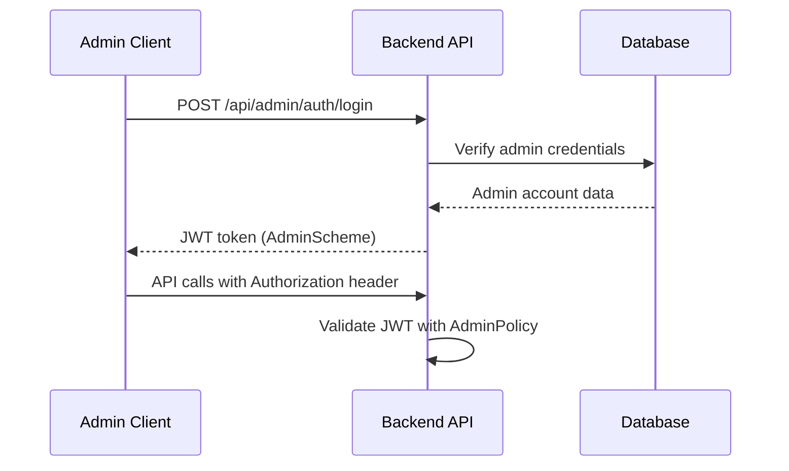
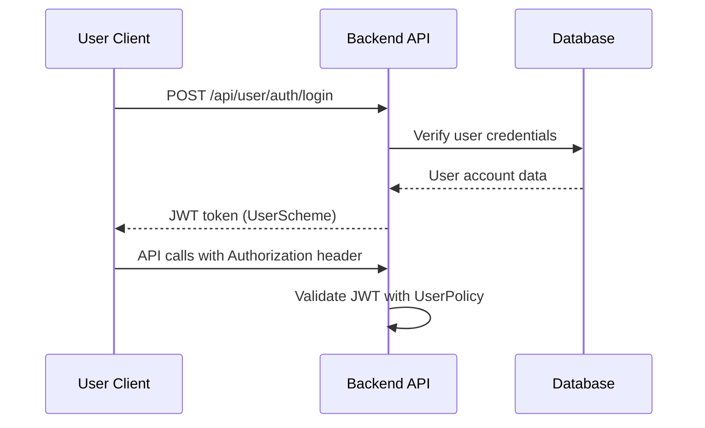

# KIẾN TRÚC HỆ THỐNG DIỄN ĐÀN Y TẾ

## TỔNG QUAN HỆ THỐNG

Hệ thống diễn đàn y tế là một ứng dụng web toàn diện được xây dựng với kiến trúc 3 tầng hiện đại, hỗ trợ hai hệ thống con chính:

- **Hệ thống người dùng**: Nền tảng diễn đàn chính cho cộng đồng y tế
- **Hệ thống quản trị**: Dashboard quản lý và điều hành toàn bộ hệ thống

### MÔ HÌNH BÀI TOÁN TỔNG QUÁT

```text
┌─────────────────────────────────────────────────────────────────────────┐
│                       HỆ THỐNG DIỄN ĐÀN Y TẾ                           │
│                                                                         │
│  ┌─────────────────────────────────────────────────────────────────┐    │
│  │                    HỆ THỐNG NGƯỜI DÙNG                         │    │
│  │                                                                 │    │
│  │  👥 Thành viên    👨‍⚕️ Chuyên gia    👤 Khách truy cập           │    │
│  │       │              │                    │                    │    │
│  │       ▼              ▼                    ▼                    │    │
│  │  ┌─────────────────────────────────────────────────────────┐    │    │
│  │  │            REACT USER FRONTEND                          │    │    │
│  │  │    • Trang chủ diễn đàn                                 │    │    │
│  │  │    • Tạo và thảo luận chủ đề                            │    │    │
│  │  │    • Tương tác chuyên gia                               │    │    │
│  │  │    • Tìm kiếm thông tin y tế                            │    │    │
│  │  │    • Hỗ trợ khẩn cấp 24/7                               │    │    │
│  │  └─────────────────────────────────────────────────────────┘    │    │
│  └─────────────────────────────────────────────────────────────────┘    │
│                                   │                                     │
│                              HTTP/HTTPS                                 │
│                                   │                                     │
│  ┌─────────────────────────────────▼───────────────────────────────────┐ │
│  │                      ASP.NET CORE API                              │ │
│  │                                                                     │ │
│  │  ┌─────────────────┐  ┌─────────────────┐  ┌─────────────────────┐  │ │
│  │  │ User Controllers│  │Admin Controllers│  │  Common Services    │  │ │
│  │  │                 │  │                 │  │                     │  │ │
│  │  │ • AuthController│  │ • AuthController│  │ • JWT Service       │  │ │
│  │  │ • HomeController│  │ • UserController│  │ • HTML Sanitizer    │  │ │
│  │  │ • TopicController│ │ • ExpertCtrl    │  │ • Security Policies │  │ │
│  │  │ • CategoryCtrl  │  │ • CategoryCtrl  │  │                     │  │ │
│  │  │ • ExpertCtrl    │  │ • TopicCtrl     │  │                     │  │ │
│  │  │ • ProfileCtrl   │  │ • DashboardCtrl │  │                     │  │ │
│  │  │ • SearchCtrl    │  │ • SearchCtrl    │  │                     │  │ │
│  │  └─────────────────┘  └─────────────────┘  └─────────────────────┘  │ │
│  └─────────────────────────────────────────────────────────────────────┘ │
│                                   │                                     │
│                              Entity Framework                            │
│                                   │                                     │
│  ┌─────────────────────────────────▼───────────────────────────────────┐ │
│  │                          SQL SERVER DATABASE                       │ │
│  │                                                                     │ │
│  │  ┌───────────────┐ ┌───────────────┐ ┌───────────────────────────┐  │ │
│  │  │  USER DATA    │ │ CONTENT DATA  │ │    SYSTEM DATA            │  │ │
│  │  │               │ │               │ │                           │  │ │
│  │  │• UserAccounts │ │• Topics       │ │• AdminAccounts            │  │ │
│  │  │• AdminAccounts│ │• Posts        │ │• Categories               │  │ │
│  │  │• Specialties  │ │• Likes        │ │• Tags                     │  │ │
│  │  │               │ │• Reports      │ │• StaticPages              │  │ │
│  │  │               │ │• TopicViews   │ │• TopicTags                │  │ │
│  │  └───────────────┘ └───────────────┘ └───────────────────────────┘  │ │
│  └─────────────────────────────────────────────────────────────────────┘ │
│                                   ▲                                     │
│                                   │                                     │
│  ┌─────────────────────────────────┴───────────────────────────────────┐ │
│  │                    HỆ THỐNG QUẢN TRỊ                               │ │
│  │                                                                     │ │
│  │  👨‍💼 Super Admin    👨‍💻 Admin    👮‍♂️ Moderator                        │ │
│  │        │               │            │                             │ │
│  │        ▼               ▼            ▼                             │ │
│  │  ┌─────────────────────────────────────────────────────────────┐    │ │
│  │  │           REACT ADMIN DASHBOARD                             │    │ │
│  │  │    • Thống kê và phân tích                                  │    │ │
│  │  │    • Quản lý người dùng                                     │    │ │
│  │  │    • Quản lý chuyên gia                                     │    │ │
│  │  │    • Kiểm duyệt nội dung                                    │    │ │
│  │  │    • Xử lý báo cáo                                          │    │ │
│  │  │    • Cấu hình hệ thống                                      │    │ │
│  │  └─────────────────────────────────────────────────────────────┘    │ │
│  └─────────────────────────────────────────────────────────────────────┘ │
└─────────────────────────────────────────────────────────────────────────┘
```

### ĐẶC ĐIỂM KIẾN TRÚC CHÍNH

- **Kiến trúc 3 tầng**: Frontend (React) - API (ASP.NET Core) - Database (SQL Server)
- **Dual Authentication**: JWT riêng biệt cho Admin và User
- **RESTful API**: Endpoints chuẩn REST cho tất cả operations
- **Responsive Design**: Hỗ trợ đầy đủ mobile và desktop
- **Security First**: HTML sanitization, XSS protection, role-based access

---

## KIẾN TRÚC BACKEND - ASP.NET CORE 8.0

### CẤU TRÚC LAYERED ARCHITECTURE

```text
┌─────────────────────────────────────────────────────────────────────────┐
│                           PRESENTATION LAYER                           │
├─────────────────────────────────────────────────────────────────────────┤
│                                                                         │
│  ┌─────────────────────┐    ┌─────────────────────┐                    │
│  │   ADMIN CONTROLLERS │    │   USER CONTROLLERS  │                    │
│  │                     │    │                     │                    │
│  │ • AdminAuthController│   │ • UserAuthController│                    │
│  │ • AdminUserController│   │ • UserHomeController│                    │
│  │ • AdminExpertCtrl    │   │ • UserTopicCtrl     │                    │
│  │ • AdminCategoryCtrl  │   │ • UserCategoryCtrl  │                    │
│  │ • AdminTopicCtrl     │   │ • UserExpertCtrl    │                    │
│  │ • AdminDashboardCtrl │   │ • UserProfileCtrl   │                    │
│  │ • AdminSearchCtrl    │   │ • UserSearchCtrl    │                    │
│  └─────────────────────┘    └─────────────────────┘                    │
└─────────────────────────────────────────────────────────────────────────┘
┌─────────────────────────────────────────────────────────────────────────┐
│                           BUSINESS LOGIC LAYER                         │
├─────────────────────────────────────────────────────────────────────────┤
│                                                                         │
│  ┌─────────────────────┐  ┌─────────────────────┐  ┌─────────────────┐  │
│  │   ADMIN SERVICES    │  │   USER SERVICES     │  │ COMMON SERVICES │  │
│  │                     │  │                     │  │                 │  │
│  │• IAdminAuthService  │  │• IUserAuthService   │  │• IJwtService    │  │
│  │• IAdminUserService  │  │• IUserHomeService   │  │• IHtmlSanitizer │  │
│  │• IAdminExpertSvc    │  │• IUserTopicService  │  │                 │  │
│  │• IAdminCategorySvc  │  │• IUserCategoryService│ │                 │  │
│  │• IAdminTopicSvc     │  │• IUserExpertService │  │                 │  │
│  │• IAdminDashboardSvc │  │• IUserProfileService│  │                 │  │
│  │• IAdminSearchSvc    │  │                     │  │                 │  │
│  └─────────────────────┘  └─────────────────────┘  └─────────────────┘  │
└─────────────────────────────────────────────────────────────────────────┘
┌─────────────────────────────────────────────────────────────────────────┐
│                           DATA ACCESS LAYER                            │
├─────────────────────────────────────────────────────────────────────────┤
│                                                                         │
│  ┌─────────────────────────────────────────────────────────────────┐    │
│  │                    ENTITY FRAMEWORK CORE                       │    │
│  │                                                                 │    │
│  │  ┌─────────────────┐  ┌─────────────────┐  ┌─────────────────┐  │    │
│  │  │ REPOSITORIES    │  │   DBCONTEXT     │  │   MIGRATIONS    │  │    │
│  │  │                 │  │                 │  │                 │  │    │
│  │  │• AppDbContext   │  │• DbSet<Entity>  │  │• InitialData    │  │    │
│  │  │• EF Queries     │  │• Relationships  │  │• Seed Data      │  │    │
│  │  │• LINQ Providers │  │• Configurations │  │• Schema Updates │  │    │
│  │  └─────────────────┘  └─────────────────┘  └─────────────────┘  │    │
│  └─────────────────────────────────────────────────────────────────┘    │
└─────────────────────────────────────────────────────────────────────────┘
```

### CONTROLLER ARCHITECTURE

#### 🔐 AUTHENTICATION & AUTHORIZATION

**Dual JWT Authentication System:**
```csharp
// AdminScheme - cho Admin endpoints
[Authorize(Policy = "AdminPolicy")]
public class AdminAuthController : ControllerBase

// UserScheme - cho User endpoints  
[Authorize(Policy = "UserPolicy")]
public class UserAuthController : ControllerBase
```

**Security Policies:**
- `AdminPolicy`: JWT AdminScheme + RequireAuthenticatedUser
- `UserPolicy`: JWT UserScheme + RequireAuthenticatedUser

#### 📊 ADMIN CONTROLLERS (7 controllers)

**1. AdminAuthController**
- `POST /api/admin/auth/login` - Admin đăng nhập
- `GET /api/admin/auth/profile` - Lấy thông tin profile
- `PUT /api/admin/auth/profile` - Cập nhật profile
- `PUT /api/admin/auth/change-password` - Đổi mật khẩu

**2. AdminUserController**
- `GET /api/admin/users` - Danh sách users (pagination)
- `POST /api/admin/users/search` - Tìm kiếm users
- `GET /api/admin/users/{id}` - Chi tiết user
- `PUT /api/admin/users/{id}` - Cập nhật user
- `PUT /api/admin/users/{id}/role` - Cập nhật role
- `PUT /api/admin/users/{id}/toggle-status` - Bật/tắt trạng thái
- `DELETE /api/admin/users/{id}` - Xóa user

**3. AdminExpertController**
- `GET /api/admin/experts` - Danh sách experts
- `POST /api/admin/experts/search` - Tìm kiếm experts
- `PUT /api/admin/experts/{id}/verify` - Xác minh expert
- `GET /api/admin/experts/{id}/reviews` - Reviews của expert
- `GET /api/admin/specialties` - Danh sách specialties

**4. AdminCategoryController**
- `GET /api/admin/categories` - Danh sách categories
- `POST /api/admin/categories` - Tạo category mới
- `PUT /api/admin/categories/{id}` - Cập nhật category
- `DELETE /api/admin/categories/{id}` - Xóa category
- `PUT /api/admin/categories/reorder` - Sắp xếp lại thứ tự

**5. AdminTopicController**
- `GET /api/admin/topics` - Danh sách topics
- `POST /api/admin/topics/search` - Tìm kiếm topics
- `PUT /api/admin/topics/{id}/pin` - Pin/unpin topic
- `PUT /api/admin/posts/{id}/mark-answer` - Đánh dấu câu trả lời
- `GET /api/admin/reports` - Danh sách reports

**6. AdminDashboardController**
- `GET /api/admin/dashboard/stats` - Thống kê tổng quan
- `GET /api/admin/dashboard/chart-data` - Dữ liệu biểu đồ
- `GET /api/admin/dashboard/quick-actions` - Quick actions
- `GET /api/admin/dashboard` - Tổng hợp dashboard

**7. AdminSearchController**
- `GET /api/admin/search/global` - Tìm kiếm toàn cục
- `POST /api/admin/search/global` - Tìm kiếm nâng cao
- `GET /api/admin/search/suggestions` - Gợi ý tìm kiếm

#### 👥 USER CONTROLLERS (7 controllers)

**1. UserAuthController**
- `POST /api/user/auth/register` - Đăng ký tài khoản
- `POST /api/user/auth/login` - Đăng nhập
- `GET /api/user/auth/profile` - Thông tin profile
- `PUT /api/user/auth/profile` - Cập nhật profile
- `PUT /api/user/auth/change-password` - Đổi mật khẩu

**2. UserHomeController**
- `GET /api/user/home` - Dữ liệu trang chủ
- `GET /api/user/home/topics/latest` - Topics mới nhất
- `GET /api/user/home/topics/pinned` - Topics được pin
- `GET /api/user/home/tags/popular` - Tags phổ biến
- `GET /api/user/home/stats` - Thống kê site

**3. UserTopicController**
- `GET /api/user/topics` - Danh sách topics
- `POST /api/user/topics` - Tạo topic mới
- `GET /api/user/topics/{id}` - Chi tiết topic
- `POST /api/user/topics/{id}/posts` - Tạo post reply
- `PUT /api/user/topics/{id}/like` - Like/unlike topic
- `POST /api/user/topics/{id}/report` - Báo cáo topic

**4. UserCategoryController**
- `GET /api/user/categories` - Tất cả categories
- `GET /api/user/categories/{id}` - Chi tiết category
- `GET /api/user/categories/{id}/topics` - Topics trong category

**5. UserExpertController**
- `GET /api/user/experts` - Danh sách experts
- `GET /api/user/experts/{id}` - Chi tiết expert
- `GET /api/user/experts/{id}/topics` - Topics của expert

**6. UserProfileController**
- `GET /api/user/profile/topics` - Topics của user
- `GET /api/user/profile/posts` - Posts của user
- `GET /api/user/profile/likes` - Topics đã like
- `PUT /api/user/profile/privacy` - Cài đặt privacy

**7. UserSearchController**
- `GET /api/user/search` - Tìm kiếm topics
- `POST /api/user/search` - Tìm kiếm nâng cao
- `GET /api/user/search/suggestions` - Gợi ý tìm kiếm

---

## KIẾN TRÚC FRONTEND - REACT 19.1.1

### CẤU TRÚC DUAL FRONTEND ARCHITECTURE

```text
┌─────────────────────────────────────────────────────────────────────────┐
│                           FRONTEND ARCHITECTURE                        │
├─────────────────────────────────────────────────────────────────────────┤
│                                                                         │
│  ┌─────────────────────────────────────────────────────────────────┐    │
│  │                    ADMIN DASHBOARD                              │    │
│  │                                                                 │    │
│  │  ┌─────────────────┐  ┌─────────────────┐  ┌─────────────────┐  │    │
│  │  │   COMPONENTS    │  │      PAGES      │  │    SERVICES     │  │    │
│  │  │                 │  │                 │  │                 │  │    │
│  │  │• Layout         │  │• LoginPage      │  │• api.ts         │  │    │
│  │  │• Navigation     │  │• DashboardPage  │  │• auth.ts        │  │    │
│  │  │• DataTable      │  │• UsersPage      │  │• types/index.ts │  │    │
│  │  │• Charts         │  │• CategoriesPage │  │                 │  │    │
│  │  │• Forms          │  │• TopicsPage     │  │                 │  │    │
│  │  │• Modals         │  │• ReportsPage    │  │                 │  │    │
│  │  │• SearchBox      │  │• SettingsPage   │  │                 │  │    │
│  │  └─────────────────┘  └─────────────────┘  └─────────────────┘  │    │
│  └─────────────────────────────────────────────────────────────────┘    │
│                                   │                                     │
│                              React Router                               │
│                                   │                                     │
│  ┌─────────────────────────────────▼───────────────────────────────────┐ │
│  │                     USER FRONTEND                                  │ │
│  │                                                                     │ │
│  │  ┌─────────────────┐  ┌─────────────────┐  ┌─────────────────────┐  │ │
│  │  │   COMPONENTS    │  │      PAGES      │  │    SERVICES         │  │ │
│  │  │                 │  │                 │  │                     │  │ │
│  │  │• Layout         │  │• HomePage       │  │• api.ts             │  │ │
│  │  │• Header/Footer  │  │• TopicPage      │  │• auth.ts            │  │ │
│  │  │• TopicCard      │  │• CategoryPage   │  │• types/index.ts     │  │ │
│  │  │• PostItem       │  │• ExpertPage     │  │                     │  │ │
│  │  │• UserProfile    │  │• ProfilePage    │  │                     │  │ │
│  │  │• SearchBox      │  │• SearchPage     │  │                     │  │ │
│  │  │• CommentForm    │  │• LoginPage      │  │                     │  │ │
│  │  └─────────────────┘  └─────────────────┘  └─────────────────────┘  │ │
│  └─────────────────────────────────────────────────────────────────────┘ │
└─────────────────────────────────────────────────────────────────────────┘
```

### ADMIN DASHBOARD TECHNOLOGY STACK

- **React**: 19.1.1 với hooks và functional components
- **TypeScript**: ~5.8.3 cho type safety
- **Vite**: 7.1.2 làm build tool và dev server
- **Tailwind CSS**: 3.4.0 cho styling
- **React Router Dom**: 7.8.2 cho routing
- **Axios**: 1.12.0 cho HTTP client
- **Recharts**: 3.2.0 cho data visualization
- **React Table**: 8.21.3 cho data tables
- **Headless UI**: 2.2.7 cho accessible components
- **Heroicons**: 2.2.0 cho icons

### USER FRONTEND TECHNOLOGY STACK

- **React**: 19.1.1 với modern hooks
- **TypeScript**: ~5.8.3 cho type safety
- **Vite**: 7.1.2 build tool
- **Tailwind CSS**: 3.4.0 responsive design
- **React Router Dom**: 7.8.2 client-side routing
- **Axios**: 1.12.0 HTTP client
- **Headless UI**: 2.2.7 accessible components
- **Heroicons**: 2.2.0 cho icons

---

## DATABASE SCHEMA & ENTITIES

### CẤU TRÚC DATABASE TỔNG QUAN

```text
┌─────────────────────────────────────────────────────────────────────────┐
│                           DATABASE ARCHITECTURE                        │
├─────────────────────────────────────────────────────────────────────────┤
│                                                                         │
│  ┌─────────────────────────────────────────────────────────────────┐    │
│  │                     USER & ADMIN DATA                          │    │
│  │                                                                 │    │
│  │  ┌─────────────────┐  ┌─────────────────┐  ┌─────────────────┐  │    │
│  │  │  UserAccounts   │  │ AdminAccounts   │  │  Specialties    │  │    │
│  │  │                 │  │                 │  │                 │  │    │
│  │  │• Id (PK)        │  │• Id (PK)        │  │• Id (PK)        │  │    │
│  │  │• Username       │  │• Username       │  │• Name           │  │    │
│  │  │• Email          │  │• Email          │  │• Description    │  │    │
│  │  │• PasswordHash   │  │• PasswordHash   │  │• IsActive       │  │    │
│  │  │• Role           │  │• Role           │  │• CreatedAt      │  │    │
│  │  │• IsActive       │  │• CreatedAt      │  │• UpdatedAt      │  │    │
│  │  │• CreatedAt      │  │• UpdatedAt      │  │                 │  │    │
│  │  └─────────────────┘  └─────────────────┘  └─────────────────┘  │    │
│  └─────────────────────────────────────────────────────────────────┘    │
│                                   │                                     │
│  ┌─────────────────────────────────▼───────────────────────────────────┐ │
│  │                        CONTENT DATA                                │ │
│  │                                                                     │ │
│  │  ┌─────────────────┐  ┌─────────────────┐  ┌─────────────────────┐  │ │
│  │  │   Categories    │  │     Topics      │  │       Posts         │  │ │
│  │  │                 │  │                 │  │                     │  │ │
│  │  │• Id (PK)        │  │• Id (PK)        │  │• Id (PK)            │  │ │
│  │  │• Name           │  │• Title          │  │• Content            │  │ │
│  │  │• Slug           │  │• Slug           │  │• TopicId (FK)       │  │ │
│  │  │• Description    │  │• Content        │  │• UserId (FK)        │  │ │
│  │  │• Icon           │  │• CategoryId(FK) │  │• ParentPostId (FK)  │  │ │
│  │  │• Color          │  │• UserId (FK)    │  │• IsAnswer           │  │ │
│  │  │• DisplayOrder   │  │• IsPinned       │  │• LikesCount         │  │ │
│  │  │• IsActive       │  │• ViewsCount     │  │• CreatedAt          │  │ │
│  │  │• TopicsCount    │  │• LikesCount     │  │• UpdatedAt          │  │ │
│  │  │• CreatedAt      │  │• PostsCount     │  │                     │  │ │
│  │  └─────────────────┘  │• CreatedAt      │  └─────────────────────┘  │ │
│  │                       └─────────────────┘                          │ │
│  └─────────────────────────────────────────────────────────────────────┘ │
│                                   │                                     │
│  ┌─────────────────────────────────▼───────────────────────────────────┐ │
│  │                    INTERACTION DATA                                │ │
│  │                                                                     │ │
│  │  ┌─────────────────┐  ┌─────────────────┐  ┌─────────────────────┐  │ │
│  │  │     Likes       │  │    Reports      │  │    TopicViews       │  │ │
│  │  │                 │  │                 │  │                     │  │ │
│  │  │• Id (PK)        │  │• Id (PK)        │  │• Id (PK)            │  │ │
│  │  │• UserId (FK)    │  │• UserId (FK)    │  │• TopicId (FK)       │  │ │
│  │  │• TopicId (FK)   │  │• TopicId (FK)   │  │• UserId (FK)        │  │ │
│  │  │• PostId (FK)    │  │• PostId (FK)    │  │• ViewedAt           │  │ │
│  │  │• CreatedAt      │  │• Category       │  │• IpAddress          │  │ │
│  │  │                 │  │• Reason         │  │• UserAgent          │  │ │
│  │  │                 │  │• Status         │  │                     │  │ │
│  │  │                 │  │• CreatedAt      │  │                     │  │ │
│  │  └─────────────────┘  └─────────────────┘  └─────────────────────┘  │ │
│  └─────────────────────────────────────────────────────────────────────┘ │
│                                   │                                     │
│  ┌─────────────────────────────────▼───────────────────────────────────┐ │
│  │                      SYSTEM DATA                                   │ │
│  │                                                                     │ │
│  │  ┌─────────────────┐  ┌─────────────────┐  ┌─────────────────────┐  │ │
│  │  │      Tags       │  │   TopicTags     │  │   StaticPages       │  │ │
│  │  │                 │  │                 │  │                     │  │ │
│  │  │• Id (PK)        │  │• TopicId (FK)   │  │• Id (PK)            │  │ │
│  │  │• Name           │  │• TagId (FK)     │  │• Slug               │  │ │
│  │  │• Slug           │  │                 │  │• Title              │  │ │
│  │  │• Color          │  │                 │  │• Content            │  │ │
│  │  │• UsageCount     │  │                 │  │• IsPublished        │  │ │
│  │  │• CreatedAt      │  │                 │  │• CreatedAt          │  │ │
│  │  │• UpdatedAt      │  │                 │  │• UpdatedAt          │  │ │
│  │  └─────────────────┘  └─────────────────┘  └─────────────────────┘  │ │
│  └─────────────────────────────────────────────────────────────────────┘ │
└─────────────────────────────────────────────────────────────────────────┘
```

### 12 ENTITIES CHI TIẾT

#### 🏛️ **UserAccount** - Tài khoản người dùng
- **Id**: Primary Key
- **Username/Email**: Unique identifiers
- **Role**: Member, Expert, Moderator  
- **Profile**: DisplayName, Avatar, Bio, Location, Website
- **Expert Fields**: SpecialtyId, Credentials, IsVerifiedExpert
- **Privacy**: IsProfilePublic, IsEmailPublic
- **Status**: IsActive, IsEmailVerified

#### 👨‍💼 **AdminAccount** - Tài khoản quản trị
- **Role**: SuperAdmin, Admin, Moderator
- **Security**: PasswordHash, LastLoginAt
- **Profile**: DisplayName, Avatar
- **Status**: IsActive

#### 📁 **Category** - Danh mục chủ đề
- **Display**: Name, Slug, Description, Icon, Color
- **Order**: DisplayOrder cho sắp xếp
- **Stats**: TopicsCount (cached)
- **Status**: IsActive

#### 💬 **Topic** - Chủ đề thảo luận
- **Content**: Title, Slug, Content (HTML sanitized)
- **Relations**: CategoryId, UserId
- **Features**: IsPinned, IsLocked, IsApproved
- **Stats**: ViewsCount, LikesCount, PostsCount
- **Tags**: Many-to-many relationship với Tags

#### 📝 **Post** - Bài viết trả lời
- **Content**: HTML sanitized content
- **Hierarchy**: ParentPostId cho nested replies
- **Relations**: TopicId, UserId
- **Features**: IsAnswer, IsApproved, IsDeleted
- **Stats**: LikesCount

#### 🏷️ **Tag** - Thẻ gắn nhãn
- **Display**: Name, Slug, Color
- **Stats**: UsageCount
- **System**: CreatedAt, UpdatedAt

#### ❤️ **Like** - Tương tác thích
- **Relations**: UserId, TopicId, PostId (nullable)
- **Tracking**: CreatedAt

#### 🚨 **Report** - Báo cáo vi phạm  
- **Relations**: UserId, TopicId, PostId (nullable)
- **Content**: Category, Reason, Status
- **Processing**: Admin handling workflow

#### 👁️ **TopicView** - Lượt xem chủ đề
- **Relations**: TopicId, UserId (nullable for guests)
- **Tracking**: ViewedAt, IpAddress, UserAgent
- **Analytics**: View counting và statistics

#### 🩺 **Specialty** - Chuyên khoa y tế  
- **Content**: Name, Description
- **Status**: IsActive
- **Relations**: Many experts có thể có same specialty

#### 🔗 **TopicTags** - Liên kết Topic-Tag
- **Relations**: TopicId, TagId
- **Purpose**: Many-to-many relationship table

#### 📄 **StaticPages** - Trang tĩnh
- **Content**: Slug, Title, Content
- **Status**: IsPublished
- **Usage**: About, Privacy Policy, Terms, etc.

---

## TECHNOLOGY STACK & DEPLOYMENT

### BACKEND TECHNOLOGY STACK

#### 🔧 CORE FRAMEWORK
- **ASP.NET Core**: 8.0 - Cross-platform web framework
- **C#**: .NET 8.0 với nullable reference types
- **Entity Framework Core**: 8.0.0 ORM with SQLite provider
- **Authentication**: JWT Bearer với dual schemes (Admin/User)

#### 📦 KEY PACKAGES
```xml
<PackageReference Include="Microsoft.EntityFrameworkCore.Sqlite" Version="8.0.0" />
<PackageReference Include="Microsoft.AspNetCore.Authentication.JwtBearer" Version="8.0.0" />
<PackageReference Include="System.IdentityModel.Tokens.Jwt" Version="8.0.0" />
<PackageReference Include="BCrypt.Net-Next" Version="4.0.3" />
<PackageReference Include="Swashbuckle.AspNetCore" Version="6.5.0" />
<PackageReference Include="HtmlSanitizer" Version="8.0.865" />
```

#### 🗄️ DATABASE
- **SQLite**: Development và testing database
- **Entity Framework Core**: Code-first migrations
- **Connection String**: `DefaultConnection` trong appsettings.json

#### 🔐 SECURITY FEATURES
- **Password Hashing**: BCrypt với salt
- **JWT Tokens**: Separate keys cho Admin/User
- **HTML Sanitization**: HtmlSanitizer cho user content
- **CORS**: Configured for development (AllowAll policy)
- **Authorization Policies**: Role-based access control

### FRONTEND TECHNOLOGY STACK

#### 📱 ADMIN DASHBOARD
```json
{
  "dependencies": {
    "@headlessui/react": "^2.2.7",
    "@heroicons/react": "^2.2.0", 
    "@tanstack/react-table": "^8.21.3",
    "axios": "^1.12.0",
    "clsx": "^2.1.1",
    "date-fns": "^4.1.0",
    "react": "^19.1.1",
    "react-dom": "^19.1.1",
    "react-router-dom": "^7.8.2",
    "recharts": "^3.2.0"
  }
}
```

#### 👥 USER FRONTEND
```json
{
  "dependencies": {
    "@headlessui/react": "^2.2.7",
    "@heroicons/react": "^2.2.0",
    "axios": "^1.12.0", 
    "clsx": "^2.1.1",
    "date-fns": "^4.1.0",
    "react": "^19.1.1",
    "react-dom": "^19.1.1",
    "react-router-dom": "^7.8.2"
  }
}
```

#### 🛠️ DEVELOPMENT TOOLS
- **TypeScript**: ~5.8.3 type safety
- **Vite**: 7.1.2 build tool và dev server
- **Tailwind CSS**: 3.4.0 utility-first CSS
- **ESLint**: 9.33.0 code linting
- **Prettier**: 3.6.2 code formatting
- **PostCSS**: 8.4.0 CSS processing

### DEPLOYMENT CONFIGURATION

#### 🚀 DEVELOPMENT ENVIRONMENT
```json
{
  "profiles": {
    "ApiApplication": {
      "commandName": "Project",
      "launchBrowser": true,
      "environmentVariables": {
        "ASPNETCORE_ENVIRONMENT": "Development"
      },
      "applicationUrl": "https://localhost:51123;http://localhost:51124"
    }
  }
}
```

#### 🌐 API ENDPOINTS
- **Backend API**: http://localhost:5002, https://localhost:7002
- **Admin Frontend**: Vite dev server (thường port 5173)
- **User Frontend**: Vite dev server (thường port 5174)

#### 📊 DATABASE SETUP
- **SQLite File**: Tạo tự động khi chạy ứng dụng
- **Migrations**: `20250918121938_InitialData`
- **Seed Data**: 30 records mỗi entity để testing

#### 🔧 BUILD & RUN COMMANDS
```bash
# Backend
dotnet run

# Admin Frontend
cd View/admin
npm run dev

# User Frontend  
cd View/user
npm run dev
```

### SECURITY ARCHITECTURE

#### 🔐 AUTHENTICATION FLOW

**Admin Authentication:**


**User Authentication:**


#### 🛡️ SECURITY MEASURES
- **Password Security**: BCrypt hashing với salt
- **Token Security**: Separate JWT keys cho Admin/User
- **Content Security**: HTML sanitization cho tất cả user input
- **XSS Protection**: HtmlSanitizer library
- **SQL Injection**: Entity Framework parameterized queries
- **CSRF Protection**: Built-in ASP.NET Core protection

### PERFORMANCE OPTIMIZATION

#### 📈 DATABASE INDEXES
- **User Lookups**: Email, Username indexes
- **Topic Performance**: CategoryId+CreatedAt composite index
- **Post Hierarchy**: TopicId+CreatedAt cho pagination
- **Search Performance**: Tags UsageCount index

#### ⚡ CACHING STRATEGY
- **Entity Counts**: Cached counts trong parent entities
- **Popular Data**: Tags usage count, topic views
- **Static Content**: Categories, specialties có thể cache

#### 🔄 API DESIGN
- **Pagination**: Implemented cho tất cả listing endpoints
- **Search**: Dedicated search endpoints với filters
- **Lazy Loading**: EF Core navigation properties
- **DTO Pattern**: Separate response models

---

## KẾT LUẬN VÀ ĐÁNH GIÁ

### ✅ ĐIỂM MẠNH CỦA HỆ THỐNG

1. **Kiến trúc rõ ràng**: Layered architecture với separation of concerns
2. **Security tốt**: Dual JWT authentication, HTML sanitization, BCrypt
3. **Modern Stack**: React 19.1.1, ASP.NET Core 8.0, Entity Framework Core
4. **Scalable Design**: RESTful APIs, pagination, caching strategy
5. **Type Safety**: TypeScript frontend, C# nullable types
6. **Developer Experience**: Vite build tool, hot reload, ESLint/Prettier

### 🔄 KHUYẾN NGHỊ CẢI TIẾN

1. **Database Migration**: Chuyển từ SQLite sang SQL Server/PostgreSQL cho production
2. **Caching Layer**: Implement Redis cho session và data caching
3. **File Storage**: Thêm Azure Blob/S3 cho user avatars và attachments
4. **Monitoring**: Application Insights hoặc Serilog cho logging
5. **CI/CD Pipeline**: GitHub Actions cho automated deployment
6. **Testing**: Unit tests và integration tests cho backend APIs

### 📋 CHỨC NĂNG HOÀN THIỆN

#### ✅ ĐÃ IMPLEMENT
- Dual authentication system (Admin/User)
- Complete CRUD operations cho tất cả entities
- Forum functionality với topics, posts, likes, reports
- Expert system với specialties và verification
- Search functionality với suggestions
- Admin dashboard với statistics và charts
- Responsive UI với Tailwind CSS
- Database seeding với sample data

#### 🔄 CẦN BỔ SUNG
- File upload functionality cho avatars
- Email verification system
- Push notifications
- Real-time chat với SignalR
- Advanced search với Elasticsearch
- Multi-language support
- Mobile app với React Native

### 📊 SYSTEM METRICS

- **Backend**: 14 Controllers, 30+ Services, 12 Entities
- **Frontend**: 2 React applications, 50+ components
- **Database**: 12 tables với proper indexing
- **API Endpoints**: 40+ RESTful endpoints
- **Authentication**: Dual JWT schemes với role-based access
- **Security**: HTML sanitization, XSS protection, CSRF protection
